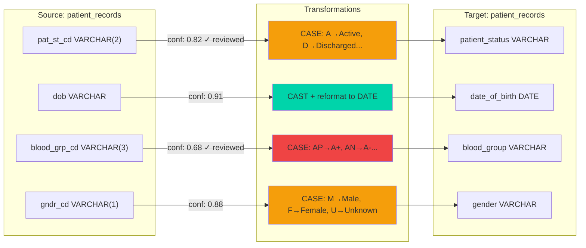

# FDE Capstone Plan - AI-Assisted Legacy Data Migration

## Stack Decisions

- Source: PostgreSQL (Docker) - free, easy local setup
- Target: Snowflake (30-day trial, $400 credits)
- Domain: Healthcare (Clinical Operations)
- Base: Existing zip project - expand, don't rebuild
- Standout Feature: Auto-generated data lineage visualization (Mermaid diagrams)
- LLM: Google Gemini (via LangChain + langchain-google-genai), selected for free credits during development. Provider is abstracted behind `config/llm_factory.py` (`LLM_PROVIDER` env var) so Anthropic Claude can be added later as a second/alternate option without touching agent code.
- Primary dev tool: Claude Code CLI

## Time Budget (4.5-5 hours)

Since the base project already has the LangGraph orchestrator, all 7 nodes, audit logger, settings, and agent scaffolding in place, the work is additive - not from scratch.

| Phase | Time | What gets done | Base status |
|-------|------|----------------|-------------|
| Phase 1 - Schema expansion + seed data | 40 min | Expand 5-table schema to 8 tables, write seed script (10k+ rows) | init_db.sql exists but minimal, no seed script |
| Phase 2 - LLM swap + LangFuse | 25 min | LLM swap (OpenAI to Gemini via provider factory) and LangFuse callback/scoring wiring both done | Complete |
| Phase 3 - Great Expectations | 35 min | GX suites for all 3 checkpoints implemented (GX 1.x API); also fixed a pre-existing Snowflake schema-qualification bug and slow row-by-row insert in executor.py | Complete |
| Phase 4 - dbt models | 20 min | Replace stub SQL with real row count, null rate, FK integrity models | Single stub SELECT exists |
| Phase 5 - Lineage visualization | 30 min | Build lineage_generator.py, Mermaid output, color-coded by confidence | Entirely missing |
| Phase 6 - executor type mapping | 15 min | Add source-to-Snowflake type mapping (not all VARCHAR) | Currently loads everything as VARCHAR |
| Phase 7 - Documentation update | 25 min | Update README + DECISIONS.md for healthcare domain, add lineage section | Exists but wholesale/generic references |

Total: ~3 hrs 10 min (leaves buffer for testing + unexpected issues)

---

## What the Base Project Already Has (Do Not Rebuild)

These are solid and should be used as-is:

- `workflow/langgraph_orchestrator.py` - All 7 nodes wired, real LangGraph `interrupt()` for human review gate, state schema, edge routing
- `audit/audit_logger.py` - SHA-256 hash-chained append-only logger, thread-safe
- `agents/schema_profiler.py` - Full SQLAlchemy reflection, null rates, cardinality, value distribution, FK graph
- `agents/rule_generator.py` - TransformationRule Pydantic model, pre-execution confidence validation
- `agents/doc_generator.py` - LangChain doc generation, writes target data dictionary
- `config/settings.py` - Clean dataclass-based settings from .env
- `migration/executor.py` - Snowflake load with tenacity retry + exponential backoff
- `validation/validator.py` - Source baseline + reconciliation report structure
- `docker-compose.yml` - PostgreSQL container setup
- `audit/migration_audit_log.json` - Initialized and ready
- `tests/test_confidence_gate.py` - Basic gate logic tests
- `data/example_*.json` - Example rule and mapping shapes

---

## Phase 1 - Schema Expansion + Seed Data (40 min)

### 1.1 Expand init_db.sql

Keep the existing 5 tables. Add 3 more to reach 8 total, increasing clinical complexity and giving the AI mapper more varied ambiguity to work with.

**Existing tables (keep, add columns):**

| Table | Additions |
|-------|-----------|
| `departments` | Add `dept_typ_cd` (VARCHAR(3): 'IPD', 'OPD', 'ICU', 'ER', 'SRG') - undocumented |
| `patient_records` | Add `dob` as VARCHAR (legacy stored as string 'DD-MM-YYYY'), `blood_grp_cd` (VARCHAR(3): 'AP', 'AN', 'BP', 'BN', 'OP', 'ON', 'ABP', 'ABN'), `gndr_cd` (VARCHAR(1): 'M', 'F', 'U'), `ins_prvdr_cd` (VARCHAR(5): insurer codes, no lookup) |
| `doctors` | Add `spec_cd` (VARCHAR(5): specialization codes 'CARD', 'ORTH', 'NEUR', 'PEDS', 'ONCO'), `qlf_cd` (VARCHAR(10): qualification codes 'MBBS', 'MD', 'MS', 'DM', 'MCH') |
| `appointments` | Add `appt_typ_cd` (VARCHAR(3): 'NEW', 'FLW', 'EMR', 'REV'), `cncl_rsn` (VARCHAR free text, often NULL), `pri_lvl` (INT: 1-5, undocumented priority) |
| `billing` | Add `pay_mthd_cd` (VARCHAR(3): 'CSH', 'INS', 'CRD', 'UPI'), `ins_clm_st` (VARCHAR(2): 'PN', 'AP', 'RJ', 'PP'), `disc_pct` (NUMERIC: discount %, nullable) |

**New tables (add 3):**

| Table | Purpose | Legacy quirks |
|-------|---------|---------------|
| `med_records` | Medication prescriptions | `med_cd` (drug codes, no lookup), `dosage_txt` (free text: '1x2', 'BD', 'TDS', 'SOS'), `rte_cd` (route: 'OR', 'IV', 'IM', 'SC'), `dur_days` as VARCHAR |
| `lab_orders` | Lab test orders | `tst_cd` (test codes: 'CBC', 'LFT', 'KFT', 'TSH', 'XRAY'), `tst_st_cd` (VARCHAR(2): 'OR', 'PR', 'CM', 'CN'), `rslt_txt` (free text results, often NULL), `urgcy_cd` (VARCHAR: 'ROU', 'URG', 'STT') |
| `ward_alloc` | Ward/bed allocation | `ward_cd` (VARCHAR: 'G1', 'G2', 'ICU', 'PVTW', 'SRG'), `bed_no` (VARCHAR: '101A', '202B' - alphanumeric), `alloc_st` (VARCHAR(1): 'A', 'V', 'M', 'B'), `alloc_dt` as VARCHAR |

**Total: 8 tables, 30+ columns, most with undocumented codes.**

Key ambiguities the AI mapper will hit (drives human review gate):
- `blood_grp_cd`: 'AP' could be A-Positive or something else entirely - confidence will be low
- `appt_st` (INT in existing schema, no meaning documented): 1/2/3/4/5 - no context
- `ins_clm_st`: 'PP' could be Partially Paid or Pre-Processing - requires domain review
- `dosage_txt` free text ('BD', 'TDS', 'SOS'): pharmaceutical abbreviations, AI will flag these
- `alloc_st`: single char codes with no table comment
- `pri_lvl` INT: is 1 highest priority or lowest? - genuinely ambiguous

### 1.2 Seed Script

New file: `seed/seed_db.py`

Row targets:
- `patient_records`: 12,000 rows
- `appointments`: 15,000 rows (multiple per patient)
- `billing`: 13,000 rows
- `med_records`: 20,000 rows
- `lab_orders`: 18,000 rows
- `departments`: 12 rows (reference data)
- `doctors`: 150 rows
- `ward_alloc`: 8,000 rows

Use `Faker` for names, dates. Use `random.choice` for all code columns. Inject deliberate data quality issues:
- 3-5% NULL rate on nullable FKs
- ~2% NULL on `pat_st_cd`, `appt_st`
- `dob` stored inconsistently: mix of 'DD-MM-YYYY' and 'YYYY-MM-DD' in same column (simulates organic legacy growth)
- `dur_days` in `med_records`: mix of '7', '7 days', 'one week' (genuinely messy)

---

## Phase 2 - LLM Swap + LangFuse (25 min)

### 2.1 Swap OpenAI to Gemini (done ahead of schedule, during prerequisite setup)

Rather than hardcoding a single provider in each agent, `config/llm_factory.py` was introduced as a thin provider switch, read via `LLM_PROVIDER` (`google_genai` default, `anthropic` and `openai` also supported). All three agent files (`agents/ai_mapper.py`, `agents/rule_generator.py`, `agents/doc_generator.py`) now call `get_chat_llm()` instead of instantiating `ChatOpenAI` directly:

```python
# config/llm_factory.py
def get_chat_llm(temperature=0):
    if settings.llm_provider == "google_genai":
        from langchain_google_genai import ChatGoogleGenerativeAI
        return ChatGoogleGenerativeAI(google_api_key=settings.llm_api_key, model=settings.llm_model, temperature=temperature)
    if settings.llm_provider == "anthropic":
        from langchain_anthropic import ChatAnthropic
        return ChatAnthropic(api_key=settings.llm_api_key, model=settings.llm_model, temperature=temperature)
    ...

# agents/ai_mapper.py (and rule_generator.py, doc_generator.py)
from config.llm_factory import get_chat_llm
llm = get_chat_llm().with_structured_output(MappingSuggestion)
```

`requirements.txt`: removed `langchain-openai`, added `langchain-google-genai>=2.0`. Adding Claude later is just `pip install langchain-anthropic`, setting `LLM_PROVIDER=anthropic`, and updating `LLM_API_KEY`/`LLM_MODEL` in `.env` — no agent code changes.

`.env` / `.env.example`:
```
LLM_PROVIDER=google_genai
LLM_API_KEY=your_gemini_api_key_here
LLM_MODEL=gemini-flash-latest
```

Note: Gemini's free tier gives **zero** request quota to `-pro` models (confirmed via a live 429 during setup) — `gemini-flash-latest` is the model that actually has free-tier quota and is what's configured. If richer reasoning is needed later, either request pro-tier quota/billing or switch `LLM_PROVIDER` to `anthropic`.

### 2.2 Wire LangFuse (done)

The installed `langfuse` SDK is v4.x, which redesigned the integration from the original v2-era plan: the callback now lives at `langfuse.langchain.CallbackHandler` (not `langfuse.callback`), auth/host come from the `Langfuse()` client singleton reading `LANGFUSE_PUBLIC_KEY`/`LANGFUSE_SECRET_KEY`/`LANGFUSE_HOST` env vars directly (no constructor kwargs for these), and scoring is `Langfuse.create_score(...)`/`score_current_trace(...)` rather than `langfuse_handler.langfuse.score(...)`. `requirements.txt` was bumped to `langfuse>=3.0` to reflect this.

`config/observability.py` wraps this as a small helper:
```python
from langfuse import Langfuse
from langfuse.langchain import CallbackHandler
from langfuse.types import TraceContext

def get_langfuse_client():
    ...  # cached Langfuse() singleton, reads env vars automatically

def trace_id_for(run_id, node_name):
    return get_langfuse_client().create_trace_id(seed=f"{run_id}:{node_name}")

def get_langfuse_callback(run_id, node_name):
    return CallbackHandler(trace_context=TraceContext(trace_id=trace_id_for(run_id, node_name)))

def score_human_review_decision(run_id, mapping_index, source_column, decision, override_note):
    get_langfuse_client().create_score(
        trace_id=trace_id_for(run_id, "ai_mapper"),
        name="human_review_decision",
        value=1.0 if decision.lower() == "approve" else 0.0,
        data_type="BOOLEAN",
        comment=f"mapping_index={mapping_index} column={source_column} note={override_note}",
    )
```

Each agent wires the callback at LLM initialization: `llm = get_chat_llm().with_config({"callbacks": [get_langfuse_callback(run_id, "ai_mapper")], "tags": ["migration", "healthcare"]})`. Trace IDs are deterministic (seeded from `run_id` + node name), so `human_review_gate` in the orchestrator can call `score_human_review_decision(...)` after each override decision and have it land on the same `ai_mapper` trace that produced the original low-confidence suggestion — verified end-to-end via the LangFuse public API (trace + attached score both confirmed present).

---

## Phase 3 - Great Expectations (35 min, done)

Replaced the `validation/great_expectations/README.md` placeholder with `validation/great_expectations/gx_checkpoints.py`.

The installed `great-expectations` is 1.22.0, a major redesign from the 0.18.x line the plan originally targeted — `great_expectations.core.batch.RuntimeBatchRequest` no longer exists. GX 1.x's lightweight path is `gx.get_context(mode="ephemeral")` + `data_sources.add_pandas(...).add_dataframe_asset(...).add_batch_definition_whole_dataframe(...).get_batch(...)`, then `batch.validate(single_expectation)` per check — still no YAML/project config needed, just a different object path to get there:

```python
def run_source_baseline(profile: dict) -> dict: ...       # validates Postgres source tables directly
def run_post_extraction(extracted_data: dict, baseline_report: dict) -> dict: ...  # row counts + no dropped columns vs baseline
def run_post_load(profile: dict, run_id: str, baseline_report: dict) -> dict: ...  # validates Snowflake target vs baseline
```

**Checkpoint 1 - Source baseline expectations per table:**
- `expect_table_row_count_to_be_between` (min: seeded count * 0.95)
- `expect_column_values_to_not_be_null` for PK columns
- `expect_column_values_to_be_in_set` for known code columns (pat_st_cd: ['A','D','I','S'], appt_typ_cd: ['NEW','FLW','EMR','REV'])
- `expect_column_values_to_be_unique` for PK columns

**Checkpoint 2 - Post-extraction:**
- Row counts from extraction match source baseline counts
- No columns dropped during extraction

**Checkpoint 3 - Post-load (Snowflake):**
- Target row counts match source
- Null rates within 2% tolerance of source baseline
- Mapped status code columns contain only valid target values (e.g., patient_status in ['Active', 'Discharged', 'Inactive', 'Suspended'])

All three checkpoints write results to `data/gx_results_{checkpoint}.json`. A failure at any checkpoint raises an exception that blocks the pipeline. Known status-code domains live in `KNOWN_VALUE_SETS` in `gx_checkpoints.py`, sourced from `scripts/init_db.sql`/`seed/seed_db.py` (e.g. `pat_st_cd`: `['A','D','I','S']`, `blood_grp_cd`: the 8 seeded blood-group codes); columns not in that dict are free text / undocumented and are not domain-checked, matching the deliberate ambiguity built into the schema.

While testing `run_post_load` against real Snowflake data, found and fixed two pre-existing bugs blocking it:
- `migration/executor.py` created the `MIGRATION_STAGE` schema but never actually wrote into it — `CREATE SCHEMA IF NOT EXISTS` doesn't switch the connection's current schema the way `USE SCHEMA` would, so every table silently landed in `PUBLIC` instead. Fixed by fully qualifying every target table reference via a new `qualified_target_table(table, run_id)` helper, used consistently by the executor, `validation/validator.py`, and `gx_checkpoints.py`.
- `_load_rows` inserted one row at a time inside a single long transaction — 27k rows took over 16 minutes without completing. Rewritten to batch in chunks of 500 (matching the pattern already used in `seed/seed_db.py`), bringing the same load down to ~70 seconds.

Verified end-to-end: all three checkpoints run for real against the live Postgres source and a real Snowflake load (`patient_records`, `appointments`), all passing.

---

## Phase 4 - dbt Models (20 min)

Replace the stub `migration_reconciliation.sql` with real models.

New structure:
```
validation/dbt_models/
├── dbt_project.yml
├── profiles.yml
└── models/
    ├── row_count_reconciliation.sql
    ├── null_rate_check.sql
    └── fk_integrity_check.sql
```

**row_count_reconciliation.sql:**
```sql
-- Compares source vs target row counts per migrated table
-- Source counts come from reconciliation_report.json (loaded as a seed)
-- Target counts queried live from Snowflake staging schema
SELECT
    table_name,
    source_row_count,
    target_row_count,
    source_row_count - target_row_count AS row_delta,
    CASE WHEN source_row_count = target_row_count THEN 'PASS' ELSE 'FAIL' END AS status
FROM {{ ref('migration_counts_seed') }}
```

**null_rate_check.sql:**
Compares null rates per column between source profile JSON and target. Flags any column where null rate delta exceeds 2%.

**fk_integrity_check.sql:**
Verifies FK relationships are intact in Snowflake - e.g., every `appointments.pat_id` exists in `patient_records.pat_id` in the target schema.

`schema.yml` gets proper column-level tests: `not_null`, `accepted_values`, `relationships`.

---

## Phase 5 - Lineage Visualization (30 min) - STANDOUT

New file: `lineage/lineage_generator.py`

This runs after `rule_generator` completes and reads from `data/approved_mappings.json` + `data/transformation_rules.json`. No dependency on live DB or LLM.

**What it builds:**

A Mermaid `graph LR` diagram grouped by source table, with three columns:
- Left subgraph: source table + column (with original data type)
- Middle node: transformation logic summary (CASE / CAST / direct map)
- Right subgraph: target table + column (with mapped type)

**Color coding by confidence:**
- `fill:#00d4aa` (green): confidence >= 0.90, auto-approved
- `fill:#f59e0b` (amber): confidence 0.80-0.89, passed threshold
- `fill:#ef4444` (red): confidence < 0.80, required human review - shows `(reviewed)` marker

**Healthcare-specific example output (partial):**


Output written to `docs/lineage.md`. One diagram per source table, all in the same file with H2 headers per table.

**Why this matters for healthcare:** Blood group codes, clinical status codes, medication routes - these are exactly the columns where a reader looking at the diagram can immediately see which transformations were human-validated versus auto-approved. That's the story the evaluator needs to see.

---

## Phase 6 - Executor Type Mapping (15 min)

Current `migration/executor.py` creates all Snowflake columns as `VARCHAR`. Fix this with a basic SQLAlchemy-to-Snowflake type map:

```python
TYPE_MAP = {
    "BIGINT": "NUMBER(38,0)",
    "INTEGER": "NUMBER(10,0)",
    "NUMERIC": "NUMBER(18,4)",
    "TIMESTAMP": "TIMESTAMP_NTZ",
    "DATE": "DATE",
    "BOOLEAN": "BOOLEAN",
    "TEXT": "VARCHAR(16777216)",
    "VARCHAR": "VARCHAR({length})",
}
```

This makes the dbt FK integrity and null rate checks actually meaningful, since column types are preserved rather than everything being VARCHAR.

---

## Phase 7 - Documentation Update (25 min)

### README.md - sections to update:

- Project Overview: change domain references from generic to healthcare clinical operations
- Architecture: add lineage visualization step after doc_generator
- Run section: add `python -m lineage.lineage_generator` as a post-pipeline step
- Add section: "Lineage Diagram" - where to find docs/lineage.md and how to render it in GitHub/VS Code
- Known Limitations: add healthcare-specific notes (clinical code ambiguity, medication abbreviation interpretation)

### DECISIONS.md - additions for healthcare:

- **Sensitive data section**: patient PII (first_name, last_name, dob), clinical data (pat_st_cd, blood_grp_cd, med_cd), insurance data (ins_prvdr_cd, ins_clm_st) - all flagged, masking/minimization approach described
- **Confidence threshold justification with healthcare examples**: `blood_grp_cd` 'AP' - why this is genuinely ambiguous and why 0.80 threshold is conservative for clinical data
- **Dosage text handling**: `dur_days` and `dosage_txt` free text fields flagged as requiring clinical SME review, not just AI mapping
- **Why Mermaid for lineage**: portable, renders natively in GitHub markdown, no external tools or licenses required, suitable for audit documentation
- **Human override examples**: document 2-3 realistic examples from the healthcare schema (blood group codes, appointment priority, claim status)

---

## Execution Order with Claude Code

Build in this sequence to minimize blocked time:

1. `scripts/init_db.sql` - schema expansion (run and verify in Docker first)
2. `seed/seed_db.py` - seed data (run, confirm row counts)
3. `agents/ai_mapper.py` + `agents/rule_generator.py` + `agents/doc_generator.py` - LLM swap to Gemini + LangFuse callbacks (both done)
4. `validation/great_expectations/gx_checkpoints.py` - GX suites
5. `validation/dbt_models/` - real SQL models
6. `lineage/lineage_generator.py` - Mermaid generator
7. `migration/executor.py` - type mapping fix
8. README.md + DECISIONS.md - documentation pass

Key Claude Code prompts:
- "Expand this PostgreSQL healthcare schema SQL to add these 3 tables and column additions, preserving existing CREATE TABLE statements"
- "Write a Python seed script using Faker to populate this schema with realistic healthcare data, injecting these specific data quality issues"
- "Add LangFuse callback handler to these 3 agent files, wired through the existing get_chat_llm() factory"
- "Implement Great Expectations suites for these 3 checkpoints using the in-memory/pandas approach, no YAML"
- "Build a Mermaid lineage diagram generator that reads approved_mappings.json and transformation_rules.json"

---

## Gap Summary vs Capstone Rubric

| Requirement | Base project | After this plan |
|-------------|-------------|-----------------|
| 7 LangGraph nodes | Done | Done |
| Human-in-the-loop gate | Done (real interrupt) | Done |
| LangFuse instrumentation | Missing | Added Phase 2 |
| Great Expectations (3 checkpoints) | README stub | Added Phase 3 |
| dbt post-migration models | Single stub SQL | Added Phase 4 |
| 10,000+ rows seed data | 1 demo row | Added Phase 1 |
| Healthcare schema with complexity | 5 minimal tables | Expanded Phase 1 |
| Gemini as LLM (Anthropic Claude as later add-on via provider factory) | Hardcoded OpenAI | Fixed ahead of Phase 2 |
| Lineage visualization | Missing | Added Phase 5 |
| Correct Snowflake type mapping | All VARCHAR | Fixed Phase 6 |
| README all 8 sections | Mostly there | Updated Phase 7 |
| DECISIONS.md with PII/domain notes | Generic | Updated Phase 7 |
| .env.example | Exists | Minor update |
| audit_log.json | Exists + hash-chained | No change |
| architecture.png | Exists | No change |

---

## Risk Mitigation

| Risk | Mitigation |
|------|------------|
| Snowflake trial setup takes longer than expected | BigQuery free tier as fallback - executor.py already has the Snowflake engine isolated in one function |
| LangFuse callback not firing correctly | Test with a single ai_mapper call before running full pipeline |
| GX version API differences | Pin to `great-expectations==0.18.x`, use in-memory approach to avoid context/config overhead |
| Seed script slow for 80k+ rows | Use bulk inserts with `executemany`, batch size 500 |
| `blood_grp_cd` and similar codes all get high confidence | Prompt engineering in ai_mapper system prompt - explicitly instruct low confidence for single/dual char codes without accompanying lookup tables |
| Time overrun | Phase 6 (type mapping) is the lowest priority - skip if needed, everything else passes without it |
