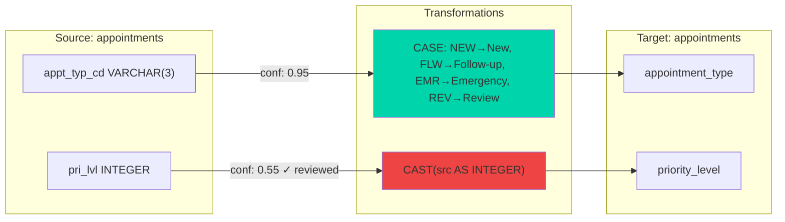
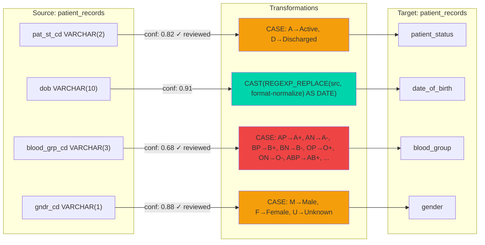

# Data Lineage

Auto-generated from `data/approved_mappings.json` and `data/transformation_rules.json`. Green = auto-approved (confidence >= 0.90), amber = passed threshold (0.80-0.89), red = required human review (confidence < 0.80).

## appointments

## patient_records

